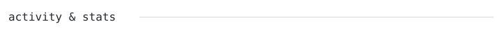
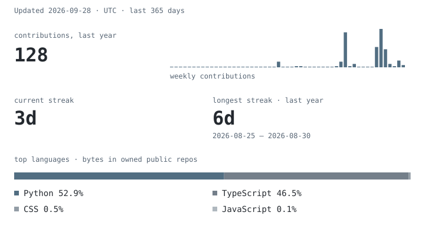

  
   
  
    
  <picture>
    <source media="(prefers-color-scheme: dark)" srcset="assets/face-dark.svg">
    
  </picture>

  <a href="https://www.linkedin.com/in/ansh14darji/">LinkedIn</a> · <a href="https://github.com/AnshDarji">GitHub</a> · <a href="https://leetcode.com/u/ANSH_9876/">LeetCode</a> · <a href="mailto:anshdarji1234@gmail.com">Email</a>

> Student at **MNNIT Allahabad (Prayagraj)**, 3rd year, Computer Science and Engineering. C++ / Python. DSA, hackathons, and AI products. Currently searching for a **Summer 2027 SDE internship**.

<code>C++ · Python · FastAPI · REST APIs · ChromaDB · SQLAlchemy · Docker · Git</code>

**Nyaay-AI**

- **Problem:** Legal guidance and civic rights information in India is fragmented, costly, and hard for citizens to understand.
- **What it does:** Grounds Gemini 2.5 Flash answers on 93 Bare Acts and 4,300+ Supreme Court judgments using hybrid BM25 + dense retrieval with metadata-aware Reciprocal Rank Fusion.
- **Tech stack:** Python, FastAPI, React, ChromaDB, Gemini API.
- **Repository:** [OOSC_4.0-AI_SLAYERS](https://github.com/OOSC-4-0-Hackathon/OOSC_4.0-AI_SLAYERS) · [Live](https://nyaay-ai-ny.vercel.app/)

**Supporting projects**

- [Talent Intelligence System](https://github.com/ctrl-alt-elite1/eightfold_AI_hackathon) — GitHub-signal candidate ranking with a skill graph. *Python, NetworkX, Sentence Transformers*
- Aegis — Voice AI incident commander.
- MediKiosk — SIH 2026 project.
- Amazon ML Challenge 2026 entry.

2026 — 1st, OOSC x GDG Hackathon, IIIT Allahabad (6,500+ participants).  
2026 — 3rd, Eightfold AI Hackathon, IIT Kanpur Techkriti '26.  
2024 — 8th, QCPC, Doha (ICPC-affiliated).

<picture>
  <source media="(prefers-color-scheme: dark)" srcset="assets/stats-dark.svg">
  
</picture>

Every graphic on this profile is generated by a scheduled GitHub Action in this repository. No third-party requests.

Open to SDE internships for Summer 2027. Best reached on LinkedIn.
